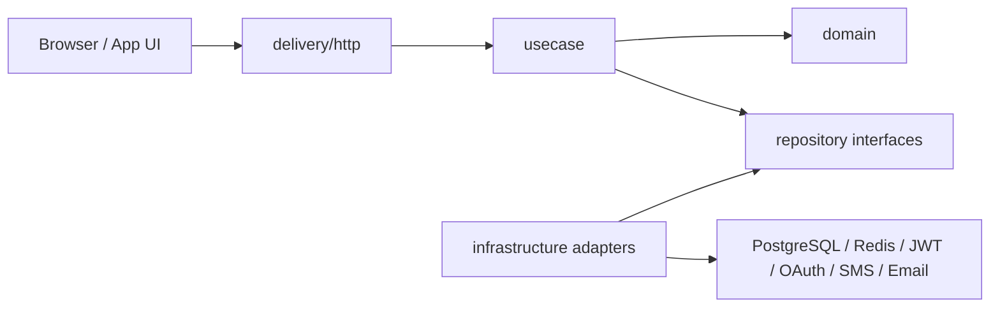

# Open Wallet Auth

[](https://github.com/HallelujahR/open-wallet-auth/actions/workflows/ci.yml)
[](https://goreportcard.com/report/github.com/HallelujahR/open-wallet-auth)
[](LICENSE)

[简体中文](README.zh-CN.md)

Open Wallet Auth is a self-hosted Web2 + Web3 authentication service for applications that want password login, wallet signature login, JWT/JWKS, and shared identity across multiple systems.

The service owns authentication. Your business applications still own their own profiles, permissions, orders, content, and domain data.

## Features

- Email/password registration and login
- Email verification code sending and checking
- Phone verification-code login
- Redis-backed verification-code storage and rate limiting
- Password-login and wallet-nonce rate limiting
- EVM wallet signature login with SIWE-compatible messages
- Authenticated wallet binding endpoint
- Google and GitHub OAuth start/callback flow
- Authenticated OAuth binding start flow
- JWT access tokens signed with RS256
- JWKS endpoint for local token verification in business APIs
- Refresh token persistence and rotation
- Refresh token session management and revocation APIs
- Authenticated password change endpoint
- Email-code password reset endpoint
- Password reset revokes existing refresh-token sessions
- Authenticated email and phone binding endpoints
- User-side email, phone, wallet, and OAuth unbinding with last-method protection
- Current-user profile read and display-profile update
- Multi-client login with `client_id` and JWT audience
- Login activity and user-client tracking
- Failed password-login audit records
- Security operation audit records for password, binding, and unbinding changes
- Internal identity management APIs for users, bindings, and login logs
- Management API for security operation audit events
- Admin unbinding APIs for wallet and OAuth account bindings
- Production configuration safety checks
- Browser CORS configuration
- Browser wallet login example
- Gin API JWT verification example

## Status

This project is moving beyond MVP for local integration and architecture validation. Production deployments must use explicit SQL migrations, strong management tokens, real SMS/email providers, strict CORS origins, and persisted JWT key files.

## Architecture

The service follows Clean Architecture with explicit boundaries between:



- HTTP delivery owns request/response mapping only.
- Usecases orchestrate authentication and account-binding workflows.
- Domain models hold core identity, token, wallet, OAuth, and audit concepts.
- Repository interfaces are ports; infrastructure adapters implement them.

See [docs/ARCHITECTURE.md](docs/ARCHITECTURE.md) for project layout and dependency rules.

## Integration

- [Chinese integration guide](docs/INTEGRATION.zh-CN.md)
- [Universal auth frontend demo](examples/universal-auth-demo)
- [Admin console demo](examples/admin-console)
- [SMS and email provider guide](docs/PROVIDERS.zh-CN.md)
- [Open source readiness checklist](docs/OPEN_SOURCE_READINESS.zh-CN.md)
- [Browser wallet login example](examples/browser-wallet-login)
- [Gin API JWT verification example](examples/gin-api)

Typical integration flow:

1. Create a client for your business application.
2. Use the browser wallet example or your own UI to request a nonce.
3. Ask the wallet to sign the returned message.
4. Exchange the signature for an access token and refresh token.
5. Verify access tokens locally in your business API through JWKS.
6. Use the JWT `sub` claim as `auth_user_id` in your own business database.

## Quick Start

Run the backend and open the universal demo in about five minutes:

```bash
cp configs/config.example.yaml configs/config.yaml
docker compose up -d postgres redis
go run ./cmd/migrate -direction up
OWA_HTTP_PORT=8081 go run ./cmd/server
```

In another terminal, serve the browser demos:

```bash
python3 -m http.server 5173
```

Health check:

```bash
curl http://localhost:8081/healthz
```

JWKS:

```bash
curl http://localhost:8081/.well-known/jwks.json
```

Open the universal demo:

```text
http://localhost:5173/examples/universal-auth-demo/
```

Use `http://localhost:8081` as the Auth Base URL. The local development email and phone verification code is `123456`.

## API Examples

Register:

```bash
curl -X POST http://localhost:8081/api/v1/auth/register \
  -H 'Content-Type: application/json' \
  -d '{"client_id":"default","username":"alice","email":"alice@example.com","password":"password123"}'
```

Login:

```bash
curl -X POST http://localhost:8081/api/v1/auth/login \
  -H 'Content-Type: application/json' \
  -d '{"client_id":"default","email":"alice@example.com","password":"password123"}'
```

Current user:

```bash
curl http://localhost:8081/api/v1/auth/me \
  -H "Authorization: Bearer <access_token>"
```

Current user profile:

```bash
curl http://localhost:8081/api/v1/profile \
  -H "Authorization: Bearer <access_token>"
```

Update display profile:

```bash
curl -X PATCH http://localhost:8081/api/v1/profile \
  -H 'Content-Type: application/json' \
  -H "Authorization: Bearer <access_token>" \
  -d '{"username":"alice_new","avatar":"https://example.com/avatar.png"}'
```

Change current password:

```bash
curl -X PATCH http://localhost:8081/api/v1/auth/password \
  -H 'Content-Type: application/json' \
  -H "Authorization: Bearer <access_token>" \
  -d '{"current_password":"password123","new_password":"new-password123"}'
```

Reset a password with an email code:

```bash
curl -X POST http://localhost:8081/api/v1/auth/password/reset \
  -H 'Content-Type: application/json' \
  -d '{"email":"alice@example.com","code":"123456","new_password":"new-password123"}'
```

Bind an email to the current user:

```bash
curl -X POST http://localhost:8081/api/v1/auth/bind/email \
  -H 'Content-Type: application/json' \
  -H "Authorization: Bearer <access_token>" \
  -d '{"email":"alice@example.com","code":"123456"}'
```

Bind a phone number to the current user:

```bash
curl -X POST http://localhost:8081/api/v1/auth/bind/phone \
  -H 'Content-Type: application/json' \
  -H "Authorization: Bearer <access_token>" \
  -d '{"phone":"+8613800000000","code":"123456"}'
```

Bind a Google or GitHub account to the current user:

```bash
curl "http://localhost:8081/api/v1/oauth/github/bind/start?client_id=default&redirect_uri=http://localhost:8081/oauth/callback" \
  -H "Authorization: Bearer <access_token>"
```

Unbind a login method from the current user:

```bash
curl -X DELETE http://localhost:8081/api/v1/auth/bind/email \
  -H "Authorization: Bearer <access_token>"

curl -X DELETE http://localhost:8081/api/v1/auth/wallets/<wallet_id> \
  -H "Authorization: Bearer <access_token>"
```

Refresh token:

```bash
curl -X POST http://localhost:8081/api/v1/auth/refresh \
  -H 'Content-Type: application/json' \
  -d '{"refresh_token":"<refresh_token>"}'
```

Logout:

```bash
curl -X POST http://localhost:8081/api/v1/auth/logout \
  -H 'Content-Type: application/json' \
  -d '{"refresh_token":"<refresh_token>"}'
```

Create a client:

```bash
curl -X POST http://localhost:8081/api/v1/clients \
  -H 'Content-Type: application/json' \
  -H 'X-Admin-Token: dev-admin-token' \
  -d '{"client_id":"example-app","name":"Example App"}'
```

List identity users for internal operations:

```bash
curl http://localhost:8081/api/v1/admin/users \
  -H 'X-Admin-Token: dev-admin-token'
```

Create a wallet nonce:

```bash
curl -X POST http://localhost:8081/api/v1/wallet/nonce \
  -H 'Content-Type: application/json' \
  -d '{"address":"0x0000000000000000000000000000000000000001","domain":"example.com","chain_id":1}'
```

Verify a wallet signature:

```bash
curl -X POST http://localhost:8081/api/v1/wallet/verify \
  -H 'Content-Type: application/json' \
  -d '{"client_id":"default","address":"<wallet_address>","nonce":"<nonce>","signature":"<signature>"}'
```

Bind a wallet to the current user:

```bash
curl -X POST http://localhost:8081/api/v1/wallet/bind \
  -H 'Content-Type: application/json' \
  -H "Authorization: Bearer <access_token>" \
  -d '{"address":"<wallet_address>","nonce":"<nonce>","signature":"<signature>"}'
```

## Configuration

Example configuration lives in [configs/config.example.yaml](configs/config.example.yaml).

Important settings:

- `database.dsn`: PostgreSQL DSN
- `jwt.issuer`: JWT issuer expected by business APIs
- `jwt.private_key_path`: RSA private key path
- `jwt.public_key_path`: RSA public key path
- `wallet.nonce_ttl`: wallet challenge lifetime
- `wallet.rate_limit_*`: wallet nonce creation limits
- `auth.rate_limit_*`: password-login limits
- `phone.code_ttl`: phone verification-code lifetime
- `phone.code_store`: verification-code storage, `memory` or `redis`
- `phone.dev_code`: local development phone code
- `phone.rate_limit_*`: phone code send and verify limits
- `phone.enabled`: enable or disable phone-code login
- `phone.provider.*`: SMS provider settings, including `noop`, `webhook`, and `aliyun_sms`
- `email.verification_enabled`: enable or disable email verification endpoints
- `email.code_store`: verification-code storage, `memory` or `redis`
- `email.rate_limit_*`: email code send and verify limits
- `email.provider.*`: email provider settings, including `noop`, `webhook`, and `smtp`
- `redis.enabled`: enable Redis adapters for code storage and rate limiting
- `oauth.google.*`: Google OAuth credentials and endpoints
- `oauth.github.*`: GitHub OAuth credentials and endpoints
- `management.admin_token`: token for management APIs; production requires a strong non-default value
- `http.cors_allowed_origins`: browser origins allowed to call the auth service

When `app.env=production`, startup rejects unsafe settings such as `database.auto_migrate=true`, exposed development verification codes, `noop` phone/email providers when enabled, wildcard/null CORS origins, weak management tokens, or missing JWT key files.

## Testing

```bash
CGO_ENABLED=0 go test ./...
CGO_ENABLED=0 go vet ./...
CGO_ENABLED=0 go build ./cmd/server
CGO_ENABLED=0 go build ./cmd/migrate
```

## Roadmap

- Stronger admin/RBAC model for service management
- More framework integration examples
